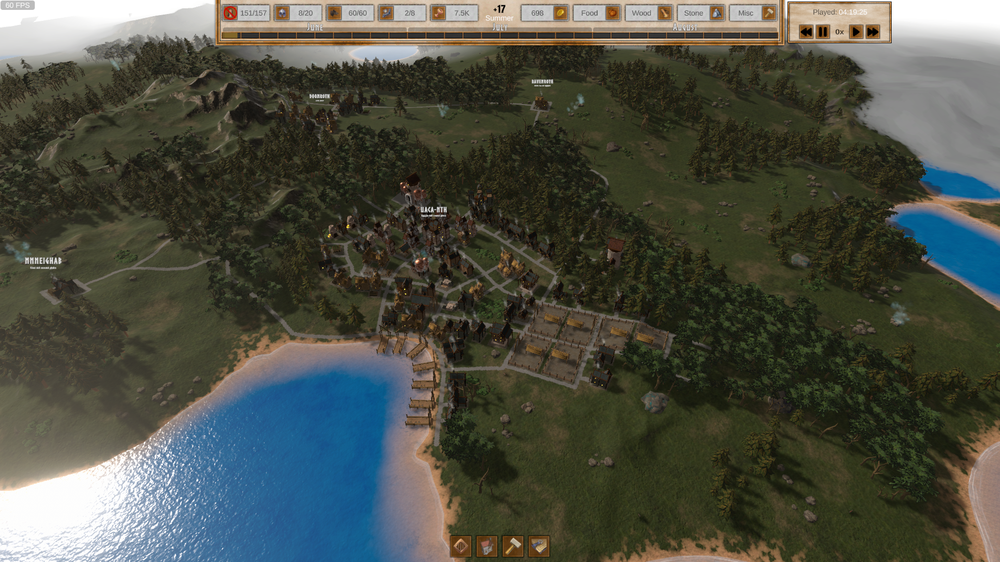

# Restikon

## 1. Description
Restikon is a hobby game project, which I'm developing whenever I have excess time at my hands. Project is using Unity game engine and most of the modeling and animating is done with Blender.

This repository is primarily for recording and tracking issues / bugs, that has been found during the development. Secondary purpose for this repository is to share some in-game screenshots and concept art from the game. The game itself is at early development stage and is not publicly available for now... Who knows will it ever be?

In terms of genre, Restikon falls somewhere between village builder and (real time) strategy. Lore is yet obscure, but it is currently leaning towards imperialism fantasy with spices from steam punkish style.

## 2. Screenshots
### Current state of GUI
Some of the icons are not there yet!

### Closeup of test village
Test session village, about 4 hours of gameplay.

### Summery test villages
Test session village, about 4 hours of gameplay.

### Autumnal test village
Test session village, about 4 hours of gameplay.

### Wintery test village
Test session village, about 4 hours of gameplay.

## 3. Concept art
### Environment
Environmental concepts from shader setup and development.
Environment is procedurally generated, shaders are height based with noise mask textures.

